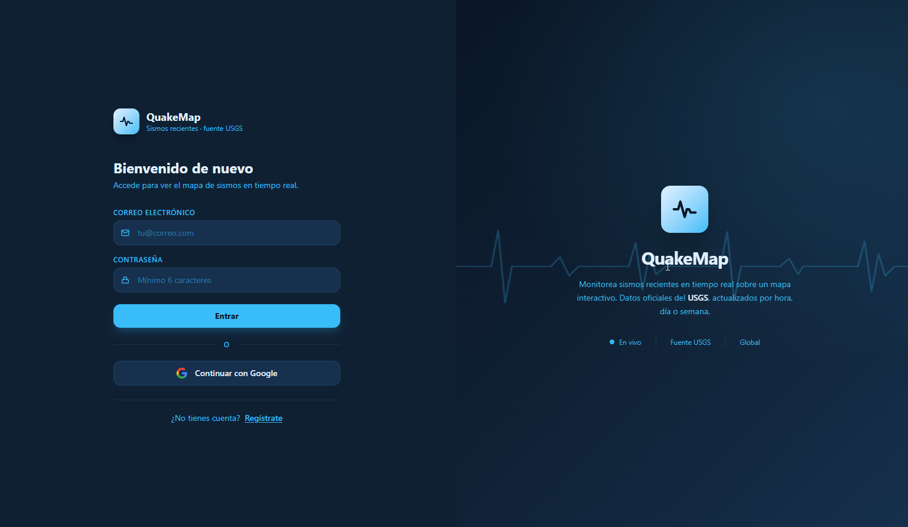
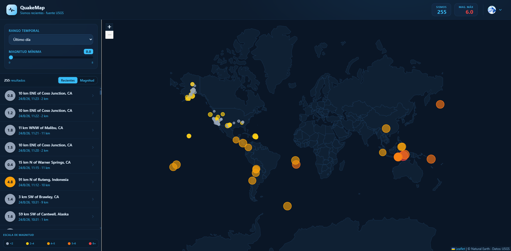

# QuakeMap

Aplicación web (solo frontend) que muestra en un mapa los **sismos recientes** del mundo,
usando la API pública de **USGS**. Módulo I · Trabajo Final — Análisis, construcción y publicación.

## Enlaces
- **Repositorio:** https://github.com/ivermm-architect/quakemap-app
- **App en Firebase:** https://quakemap-app.web.app
- **Video explicativo:** _(añade aquí el enlace al video)_

## Capturas

**Pantalla de acceso (login / registro):**



**Panel principal (mapa + histórico):**



---

## 1. El problema y a quién afecta
Millones de personas viven en zonas sísmicas y no tienen una forma rápida y visual de saber
qué sismos han ocurrido cerca en las últimas horas. La información oficial existe (USGS), pero
llega en formatos crudos (GeoJSON) poco amigables. **QuakeMap** toma esos datos abiertos y los
presenta en un mapa interactivo, ayudando a ciudadanos, docentes y curiosos a tomar conciencia
y contexto sobre la actividad sísmica reciente.

## 2. Alcance
**Incluye:**
- Consumo de la API pública de USGS (feeds GeoJSON, sin API key).
- Mapa interactivo (Leaflet) **vectorial** con un marcador por sismo.
- Color/tamaño del marcador según la magnitud y popup con lugar, magnitud, profundidad, hora y enlace a USGS.
- Filtros: rango temporal (hora / día / semana) y magnitud mínima.
- Sidebar de **histórico** con orden por tiempo/magnitud y selección sincronizada con el mapa.
- **Autenticación** con Firebase (correo/contraseña y Google): puerta de entrada a la app.

**No incluye:**
- Backend propio ni base de datos.
- Alertas/notificaciones en tiempo real ni predicción de sismos.
- Almacenamiento histórico más allá de lo que ofrece el feed de USGS.

## 3. Arquitectura

```
┌────────────────────────────────────────────────────┐
│                     Navegador                       │
│  ┌───────────────────────────────────────────────┐  │
│  │  Angular SPA (compilada, estática)             │  │
│  │  - Components: QuakeFilters, QuakeMap,         │  │
│  │                QuakeList, AuthGate             │  │
│  │  - Services:   QuakeService, AuthService       │  │
│  │  - Leaflet (mapa vectorial, sin tiles raster)  │  │
│  └───────────────────────────────────────────────┘  │
└────────────────────────────────────────────────────┘
     │  HTTPS (estáticos)    │  Auth (SDK)     │  HTTPS (GET GeoJSON)
     ▼                       ▼                 ▼
┌────────────────────┐ ┌──────────────────┐ ┌────────────────────────────┐
│ Firebase Hosting   │ │ Firebase Auth    │ │ API USGS Earthquake (feed) │
│ index.html + JS/CSS│ │ email + Google   │ │ all_hour/day/week.geojson  │
└────────────────────┘ └──────────────────┘ └────────────────────────────┘
```

Toda la lógica corre en el **navegador**. **Firebase Hosting** sirve los archivos estáticos;
**Firebase Auth** gestiona el acceso; los datos de sismos se piden directamente a **USGS** desde
el cliente. El mapa se dibuja de forma **vectorial** (países en GeoJSON, sin *tiles* raster).
No hay backend propio.

**Piezas y dónde se ejecutan:**

| Pieza | Dónde se ejecuta | Responsabilidad |
|---|---|---|
| `App` (shell) | Navegador | Layout, estado (signals) y gate de sesión |
| `AuthGate` (componente) | Navegador | Pantalla de login / registro |
| `QuakeFilters` (componente) | Navegador | UI de filtros (rango y magnitud) |
| `QuakeMap` (componente) | Navegador | Render del mapa Leaflet vectorial y marcadores |
| `QuakeList` (componente) | Navegador | Histórico con orden y selección |
| `QuakeService` | Navegador | Fetch a USGS y mapeo a `Quake` |
| `AuthService` | Navegador | Envuelve Firebase Auth (estado con signals) |
| Firebase Hosting | Nube (CDN) | Entrega de estáticos |
| Firebase Auth | Nube | Autenticación (email + Google) |
| API USGS | Externo | Fuente de datos de sismos (GeoJSON) |

## 4. Justificación de tecnologías

| Tecnología | Por qué se eligió | Alternativa descartada | Motivo del descarte |
|---|---|---|---|
| **Angular** | Framework tipado (TS) con arquitectura por componentes/servicios de fábrica | React | Angular ya se domina y da estructura opinada sin configurar tooling extra |
| **Leaflet** | Librería de mapas ligera, open source y sin API key | Google Maps JS API | Requiere API key, facturación y cuenta de Google Cloud |
| **API USGS (GeoJSON)** | Datos oficiales, gratuitos, sin autenticación ni backend intermedio | Montar un backend que cachee datos | Añade infraestructura innecesaria para el alcance |
| **HttpClient (Angular)** | Cliente HTTP integrado, tipado y con RxJS | `fetch` nativo | HttpClient integra mejor con el ecosistema Angular (interceptores, RxJS) |
| **Firebase Hosting** | Requisito de la consigna; CDN + HTTPS gratis para estáticos | GitHub Pages / Netlify | La consigna exige publicar en Firebase explícitamente |
| **Firebase Auth** | Login gestionado (email + Google) sin backend propio; SDK oficial | Auth casero con backend | Requiere servidor, base de datos y manejo de contraseñas/seguridad |

---

## Requisitos previos
- Node.js 20+ (probado con v24) y npm.
- Angular CLI 21: `npm install -g @angular/cli`
- Firebase CLI: `npm install -g firebase-tools`

## Cómo ejecutar en local
```bash
npm install
ng serve
# abre http://localhost:4200
```

## Cómo compilar para producción
```bash
ng build
# salida: dist/quakemap/browser
```

## Cómo publicar en Firebase
```bash
firebase login
# edita .firebaserc y pon tu PROJECT-ID real (o usa: firebase use --add)
ng build
firebase deploy
```
> `firebase.json` ya apunta a `dist/quakemap/browser` y tiene el rewrite de SPA a `index.html`.

---

## Estructura del proyecto
```
src/app/
├─ app.ts / app.html          # shell: estado (signals) + gate de sesión
├─ app.config.ts              # provee HttpClient
├─ core/
│  ├─ quake.ts                # QuakeService (fetch USGS + mapeo)
│  ├─ quake-model.quake.ts    # interfaz Quake
│  ├─ auth.ts                 # AuthService (Firebase Auth con signals)
│  └─ firebase-config.ts      # config web de Firebase (no secreta)
└─ features/
   ├─ auth/                   # pantalla de login / registro
   ├─ quake-filters/          # componente de filtros
   ├─ quake-map/              # componente del mapa (Leaflet vectorial)
   └─ quake-list/             # histórico con orden y selección
```

## API y recursos externos
- **USGS Earthquake Feeds** (GeoJSON, dominio público):
  `https://earthquake.usgs.gov/earthquakes/feed/v1.0/summary/`
  (`all_hour.geojson`, `all_day.geojson`, `all_week.geojson`).
- **Natural Earth / world.geo.json** — geometría vectorial de países del mapa base.

## Herramientas y código de terceros utilizados
- **Angular** (framework y Angular CLI) — base del proyecto y build.
- **Leaflet** (`leaflet`, `@types/leaflet`) — mapa interactivo.
- **Tailwind CSS v4** (`tailwindcss`, `@tailwindcss/postcss`) — capa de estilos.
- **Firebase** (`firebase`) — Authentication (email + Google).
- **RxJS** — incluido con Angular, para el manejo de las peticiones HTTP.
- **Firebase Hosting / Firebase CLI** — publicación de la app.
- **USGS** — fuente de datos de sismos; **world.geo.json** — geometría de países.
